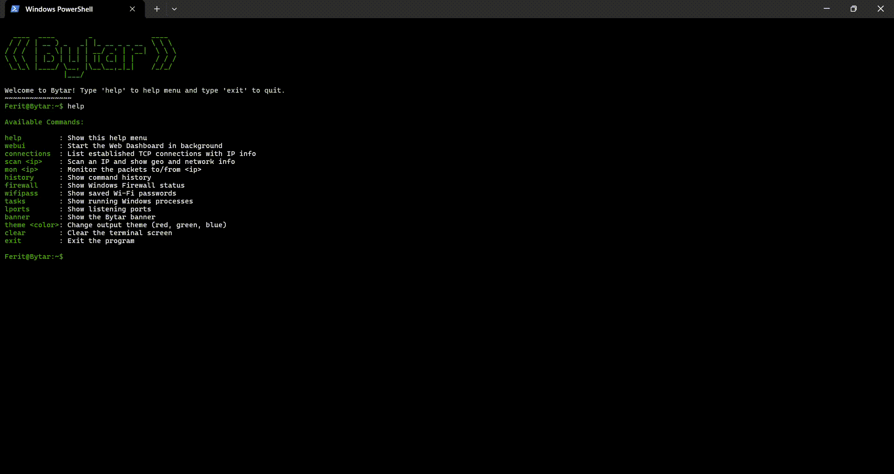

# Bytar
Bytar is a tool that performs basic network&security analysis. 

### Run
```
go run main.go
```

### Build an .exe
```
go build -o bytar.exe main.go
```

### >_ Features

- Web UI:
	Monitor and manage all system security and network data through an interactive web-based interface.

- Network Connections Viewer:
	Display all established TCP connections with detailed remote IP, port, organization, country, and hostname information.

- IP Scanner:
	Scan any IP address to retrieve geolocation, organization, and network details.

- Traffic Monitor:
	Live monitoring of network packets between your device and a target IP, with protocol, direction, and port info.

- Firewall Status:
	Instantly check the status of Windows Firewall profiles.

- Wi-Fi Password Recovery:
	List all saved Wi-Fi SSIDs and their passwords on your system.

- Running Tasks:
	Show all currently running Windows tasks.

- Listening Ports:
	Display all ports your system is currently listening on.

- Command History:
	View and reuse previous commands easily.

- Customizable Theme:
	Change the color theme of the CLI output (magenta, red, green, blue).

-Clear & Banner Commands:
	Quickly clear the terminal or display the Bytar banner.

- Help Menu:
	Built-in help menu listing all available commands.


### >_ Usage
- Web UI Usage:
	

- CLI Usage:
	


 
