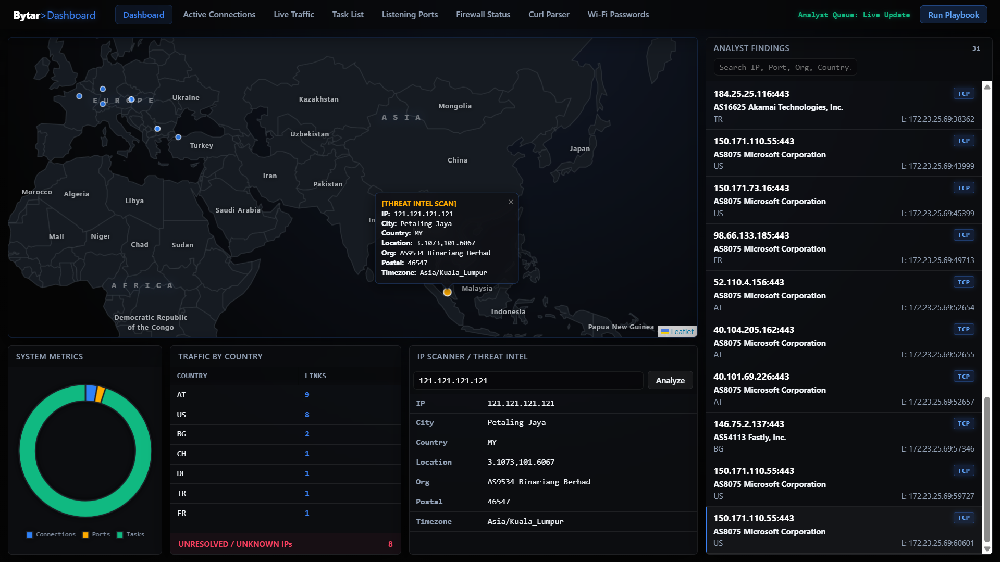
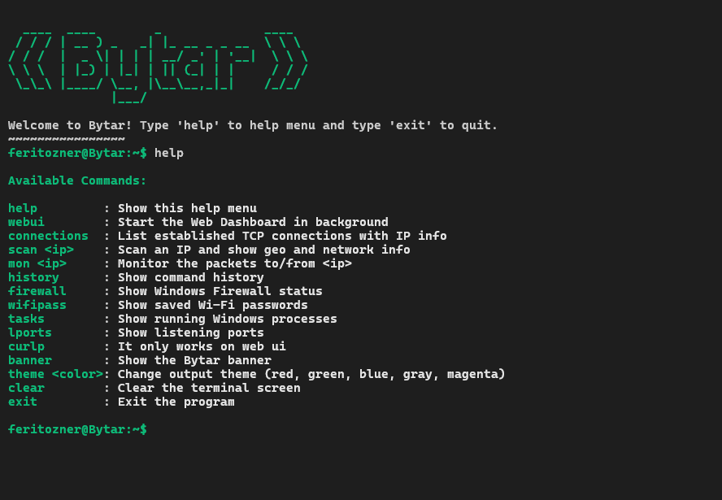

# Bytar

Bytar is a network and system monitoring tool built around manual investigation. Automated security systems often fail to catch sophisticated malware, hidden backdoors, or unusual network behavior. Bytar gives you the direct visibility needed to spot these anomalies yourself and trace them back to the exact process on your machine.

It comes with a fast terminal-based interface as well as a Web Dashboard for a better visual experience.

## How It Works

The core purpose of Bytar is to let you manually hunt down suspicious activities that slip past automated defenses. The workflow relies on your judgment:

1. **Detection:** You start by looking for anomalies. You can check all active TCP and UDP communications (`connections`), scan unknown IPs (`scan <ip>`), or look for suspicious open ports waiting for a connection (`lports`). 
2. **Observation:** If you suspect an IP or want to analyze the exact data flow, the monitoring tool (`mon <ip>`) watches the traffic in real-time. This helps you figure out the frequency of packets being sent and received, which is highly useful for identifying spyware or command-and-control (C2) communication.
3. **Hunting:** Once you identify a suspicious connection or a strange listening port, you take its PID (Process ID) and PPID (Parent Process ID). By looking up these exact IDs using the `tasks` command, you can instantly pinpoint the hidden application or background service responsible for the activity.

---

## Commands and Features

Bytar includes core tools for the workflow above, along with several built-in features to speed up your general system tasks so you don't have to switch between different programs. 

### Core Investigation Tools
These are the primary commands used for tracking down threats:
* `connections` : Lists all communicating IPs, showing both established TCP connections and active UDP endpoints along with detailed IP intelligence.
* `scan <ip>` : Scans a specific IP address and displays geographic and network details.
* `lports` : Shows all currently listening ports on the system. Crucial for finding backdoors waiting for connections.
* `mon <ip>` : Monitors incoming and outgoing packets for the specified IP address. This is your primary weapon for analyzing connectionless data transfers and packet frequency.
* `tasks` : Lists all running Windows processes. Used to match a suspicious PID to its actual executable.

### Workflow Accelerators
The remaining features are utilities designed to speed up your work and handle small tasks on the fly:
* `webui` : Starts the Web Dashboard in the background for visual management.
* `firewall` : Shows the current status of the Windows Firewall quickly.
* `wifipass` : Extracts and displays saved Wi-Fi passwords on the machine.
* `curlp` : Curl Parser (available on the Web UI) for quick payload testing.

### Terminal Management
* `theme <color>` : Changes the terminal output theme (red, green, blue, gray, magenta).
* `history` : Displays your command history.
* `banner` : Shows the Bytar startup banner.
* `clear` : Clears the terminal screen.
* `exit` : Exits the program safely.

---

## Screenshots

  
Click to view Web UI and Terminal screenshots

  
   

  ### Web Dashboard
  

  ### CLI
  

